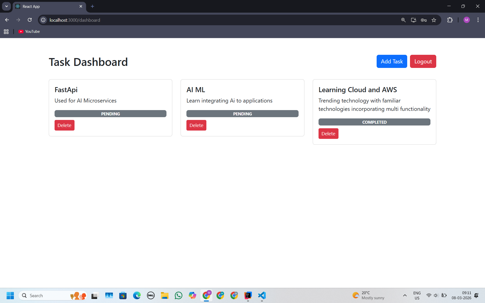

# Secure Task Management API (Spring Boot + React)

A **secure and scalable Task Management system** built using **Spring Boot, JWT Authentication, Role-Based Access Control, PostgreSQL, and React**.

This project demonstrates **secure backend API development, authentication, database design, and frontend integration**, created as part of a **Backend Developer Internship Assignment**.

---

# Tech Stack

## Backend
- Java
- Spring Boot
- Spring Security
- JWT Authentication
- Spring Data JPA
- PostgreSQL
- Swagger / OpenAPI

## Frontend
- React.js
- Axios
- React Router

## Tools
- Maven
- Postman
- Git
- IntelliJ IDEA
- VS Code

---

# Project Architecture

The project follows a **layered architecture** to ensure scalability and maintainability.

```
Controller Layer
        ↓
Service Layer
        ↓
Repository Layer
        ↓
Database
```

Additional layers include:

- Security (JWT Authentication)
- DTO Layer
- Exception Handling
- Configuration

---

# Backend Project Structure

```
com.task.taskmanager

├── config
│   ├── CorsConfig
│   ├── OpenApiConfig
│   └── SecurityConfig
│
├── controller
│   ├── TaskController
│   └── UserController
│
├── dto
│   ├── LoginRequest
│   ├── UserRequest
│   ├── TaskRequest
│   ├── TaskResponse
│   ├── ErrorResponse
│   └── ServerResponse
│
├── entity
│   ├── User
│   ├── Task
│   ├── Role
│   └── TaskStatus
│
├── exception
│   ├── GlobalExceptionHandler
│   └── ResourceNotFoundException
│
├── repository
│   ├── UserRepository
│   └── TaskRepository
│
├── security
│   ├── JwtService
│   ├── JwtAuthenticationFilter
│   └── CustomUserDetailsService
│
├── service
│   ├── UserService
│   └── TaskService
│
└── TaskmanagerApplication
```

---

# Frontend Project Structure

```
TASK-UI

src
│
├── api
│   ├── auth.js
│   └── httpClient.js
│
├── components
│   └── TaskForm.jsx
│
├── pages
│   ├── Login.jsx
│   ├── Register.jsx
│   └── Dashboard.jsx
│
├── App.js
├── index.js
└── App.css
```

---

# Authentication & Security

The application uses **JWT (JSON Web Token)** for secure authentication.

## Security Features

- Password hashing using **BCrypt**
- JWT based authentication
- Role based authorization
- Protected API endpoints
- Global exception handling
- Input validation

---

# Roles & Permissions

| Role  | Permissions |
|------|-------------|
| USER | Create, view, update tasks |
| ADMIN | Full CRUD including delete |

Example protected endpoint:

```
DELETE /api/v1/tasks/{id}
```

Accessible only by **ADMIN users**.

---

# API Versioning

All APIs are versioned.

```
/api/v1/users
/api/v1/tasks
```

This ensures **future compatibility without breaking existing clients**.

---

# API Endpoints

## Authentication

### Register User

```
POST /api/v1/users/register
```

Request

```json
{
"name": "Mahesh",
"email": "mahesh@email.com",
"password": "password123"
}
```

---

### Login

```
POST /api/v1/users/login
```

Response

```json
{
"token": "JWT_TOKEN"
}
```

---

# Task APIs

### Create Task

```
POST /api/v1/tasks
Authorization: Bearer TOKEN
```

Request

```json
{
"title": "Complete assignment",
"description": "Finish backend task",
"status": "PENDING"
}
```

---

### Get Tasks

```
GET /api/v1/tasks
```

---

### Update Task

```
PUT /api/v1/tasks/{id}
```

---

### Delete Task

```
DELETE /api/v1/tasks/{id}
```

(Admin only)

---

# Database Schema

## User Table

| Column | Type |
|------|------|
| id | Long |
| name | String |
| email | String |
| password | String |
| role | Enum |

---

## Task Table

| Column | Type |
|------|------|
| id | Long |
| title | String |
| description | String |
| status | Enum |
| created_at | Timestamp |

---

# API Documentation

Swagger documentation available at:

```
http://localhost:8080/swagger-ui.html
```

This allows:

- API testing
- Request/response schema viewing
- Authentication testing

---

# Frontend Features

The React frontend allows users to interact with the APIs.

## Features

- User Registration
- Login with JWT
- Protected Dashboard
- Create tasks
- View tasks
- Update tasks
- Delete tasks
- Error & success message display

JWT tokens are automatically attached to requests using **Axios interceptors**.

---

# Running the Project

## 1 Clone Repository

```bash
git clone https://github.com/yourusername/task-manager.git
```

---

# 2 Run Backend

Configure database in

```
application.properties
```

Example

```
spring.datasource.url=jdbc:postgresql://localhost:5432/taskdb
spring.datasource.username=postgres
spring.datasource.password=password
```

Run the application

```bash
mvn spring-boot:run
```

Backend runs on

```
http://localhost:8080
```

---

# 3 Run Frontend

```bash
cd task-ui
npm install
npm start
```

Frontend runs on

```
http://localhost:3000
```

---

# Scalability Considerations

The system is designed to scale.

## Modular Architecture

Clear separation of layers allows easy extension.

## Microservices Ready

Future separation into services:

- Authentication Service
- Task Service
- Notification Service

## Caching

Frequently accessed data can be cached using **Redis**.

## Load Balancing

Production deployments can use **Nginx / AWS Load Balancer**.

## Containerization

The project can be deployed using **Docker containers**.

---

# Future Improvements

- Refresh Token authentication
- Pagination for tasks
- Email verification
- Docker deployment
- CI/CD pipeline
- Redis caching

## Application Screenshots

### Login Page


Users can securely log in using their registered email and password.  
JWT authentication is used to authorize requests to protected APIs.

---

### User Registration


New users can create an account by providing:

- Name  
- Email  
- Password  

Passwords are securely hashed using **BCrypt** before being stored in the database.

---

### Task Dashboard




After authentication, users are redirected to the **Task Dashboard**, where they can:

- View all tasks
- Create new tasks
- Update existing tasks
- Delete tasks only for admin 
- Track task status (Pending / Completed)

Features include:

- Task cards UI
- Status tracking
- Secure API communication using **JWT tokens**

---

### API Documentation (Swagger / OpenAPI)


The backend APIs are documented using **Swagger / OpenAPI** for easy testing and development.

#### User APIs
- `POST /api/v1/users` → Register user
- `POST /api/v1/users/login` → User login
- `GET /api/v1/users` → Get all users

#### Task APIs
- `POST /api/v1/tasks` → Create new task
- `GET /api/v1/tasks` → Get paginated tasks
- `GET /api/v1/tasks/{id}` → Get task by ID
- `PUT /api/v1/tasks/{id}` → Update task
- `DELETE /api/v1/tasks/{id}` → Delete task
- `GET /api/v1/tasks/admin/all` → Get all tasks (Admin only)
